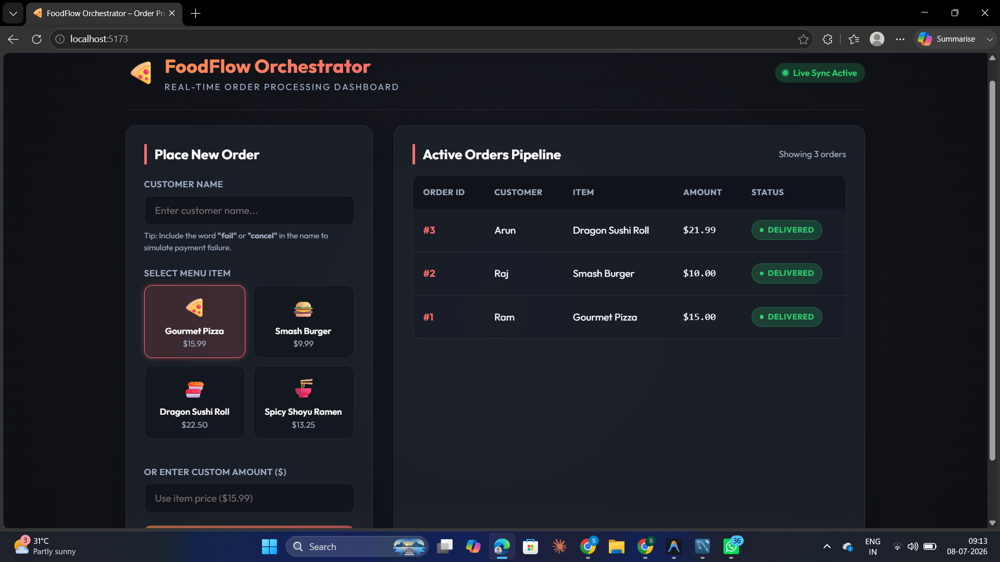
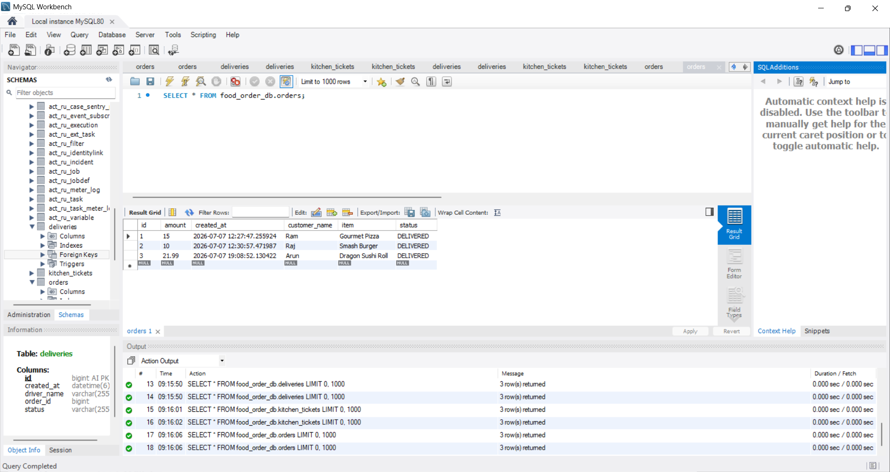
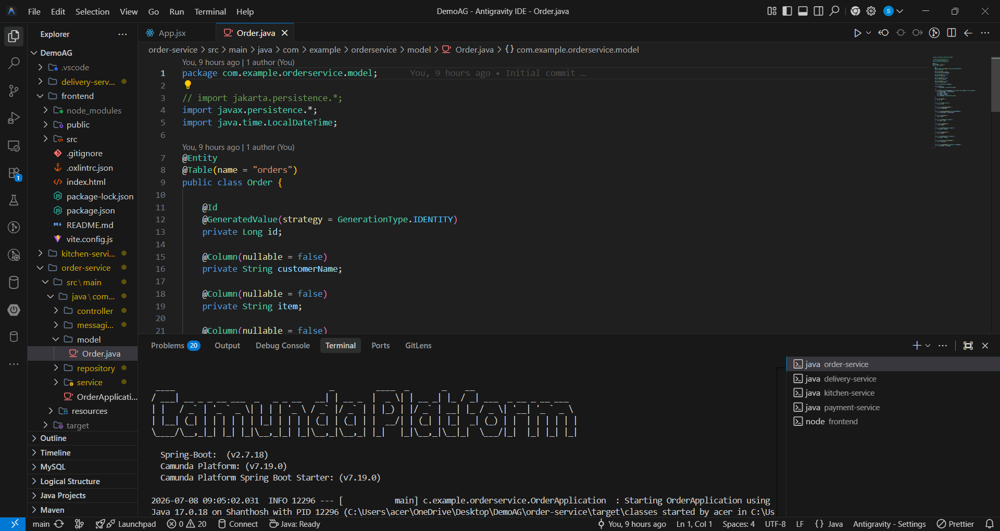
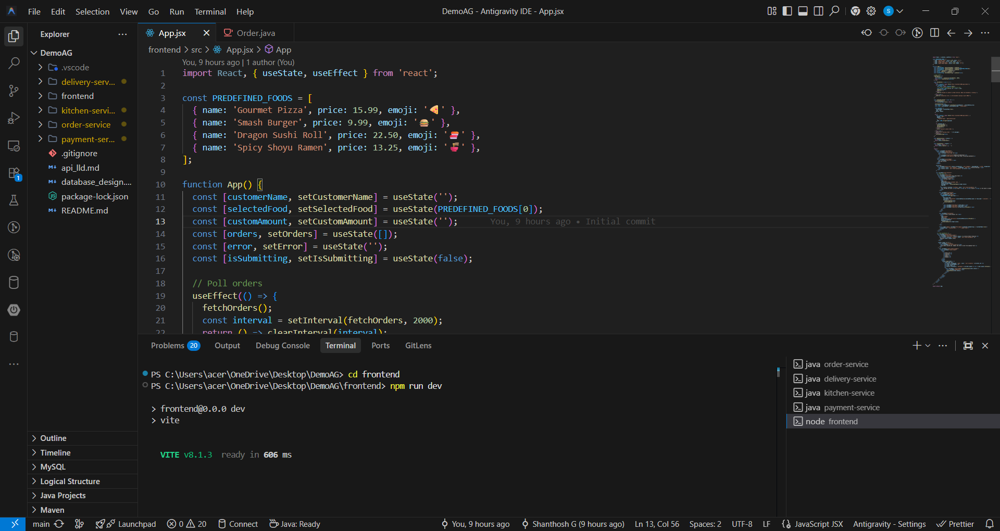
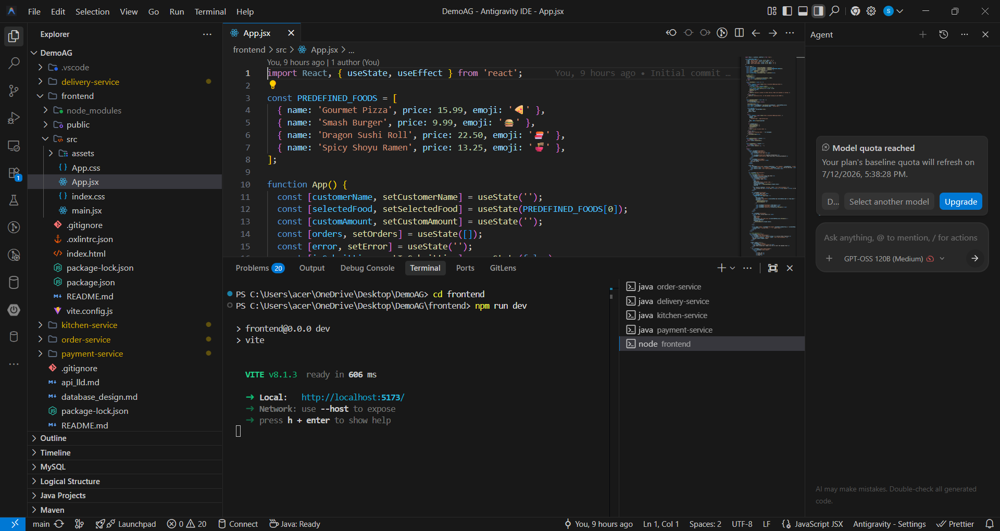

# 🍔 Online Food Order Processing System

A **Microservices-based Online Food Order Processing System** built using **Java Spring Boot, ReactJS, MySQL, Apache ActiveMQ, and Camunda BPMN**. The project demonstrates a real-world food ordering workflow using REST APIs, asynchronous messaging, and BPMN-based business process modeling.

This project was developed as a **Java Full Stack Take-Home Assessment** to showcase backend development, frontend integration, workflow orchestration, and microservices architecture.

---

## 🚀 Features

- 🍽️ Place food orders through a React frontend
- 📦 Order management using Spring Boot
- 💳 Payment processing workflow
- 👨‍🍳 Kitchen order preparation
- 🚚 Delivery assignment and completion
- 🔄 Event-driven communication using Apache ActiveMQ
- 📋 Business workflow modeled using Camunda BPMN
- 🗄️ MySQL database integration
- 🌐 RESTful API architecture
- 🧩 Independent microservices

---

# 🏗️ Architecture

```
                  React + Vite Frontend
                           │
                     REST API Calls
                           │
                  ┌──────────────────┐
                  │   Order Service  │
                  └──────────────────┘
                           │
                  Camunda BPMN Process
                           │
                     ActiveMQ Queue
                           │
                  ┌──────────────────┐
                  │ Payment Service  │
                  └──────────────────┘
                           │
                     ActiveMQ Queue
                           │
                  ┌──────────────────┐
                  │ Kitchen Service  │
                  └──────────────────┘
                           │
                     ActiveMQ Queue
                           │
                  ┌──────────────────┐
                  │ Delivery Service │
                  └──────────────────┘
                           │
                         MySQL
```

---

# 📂 Project Structure

```
Online-Food-Order-Processing-System
│
├── frontend
│
├── order-service
│
├── payment-service
│
├── kitchen-service
│
├── delivery-service
│
├── api_lld.md
│
├── database_design.md
│
└── README.md
```

---

# 🛠️ Technology Stack

## Frontend

- ReactJS
- Vite
- HTML5
- CSS3
- JavaScript
- Axios

---

## Backend

- Java 17
- Spring Boot
- Spring Web
- Spring Data JPA
- Maven
- REST APIs

---

## Workflow

- Camunda BPMN
- BPMN 2.0 Process Model

---

## Messaging

- Apache ActiveMQ

---

## Database

- MySQL

---

## Tools

- Eclipse / STS
- VS Code
- Git
- GitHub
- Postman

---

# 🧩 Microservices

## 📦 Order Service

Responsibilities

- Create customer orders
- Store order information
- Start workflow
- Publish order events

---

## 💳 Payment Service

Responsibilities

- Receive order events
- Process payment
- Publish payment status

---

## 👨‍🍳 Kitchen Service

Responsibilities

- Receive confirmed orders
- Prepare food
- Notify delivery service

---

## 🚚 Delivery Service

Responsibilities

- Assign delivery partner
- Update delivery status
- Complete order delivery

---

# 🔄 Business Workflow (Camunda BPMN)

The application models the food ordering process using a **Camunda BPMN workflow**.

The workflow includes:

1. Customer places an order
2. Order is created
3. Payment is processed
4. Kitchen prepares the food
5. Delivery is assigned
6. Order is delivered successfully

BPMN Process File:

```
order-service/src/main/resources/process.bpmn
```

---

# 🔄 Order Flow

```
Customer

    │

Place Order

    │

Order Service

    │

Camunda BPMN

    │

Payment Service

    │

Kitchen Service

    │

Delivery Service

    │

Customer Receives Food
```

---

# 📡 REST API

## Order Service

| Method | Endpoint | Description |
|---------|----------|-------------|
| POST | /orders | Create Order |
| GET | /orders | Get All Orders |
| GET | /orders/{id} | Get Order |
| PUT | /orders/{id} | Update Order |
| DELETE | /orders/{id} | Delete Order |

---

## Payment Service

| Method | Endpoint |
|---------|----------|
| POST | /payments |
| GET | /payments |

---

## Kitchen Service

| Method | Endpoint |
|---------|----------|
| GET | /kitchen/orders |
| PUT | /kitchen/{id}/prepare |

---

## Delivery Service

| Method | Endpoint |
|---------|----------|
| GET | /deliveries |
| PUT | /deliveries/{id}/dispatch |
| PUT | /deliveries/{id}/complete |

---

# 🗄️ Database

The application stores data in **MySQL**.

The database includes:

- Orders
- Payments
- Kitchen Tickets
- Delivery Details

Database documentation:

- `database_design.md`

---

# ▶️ Getting Started

## Clone Repository

```bash
git clone https://github.com/Shanthoshg/Online-Food-Order-Processing-System.git
```

---

## Configure Database

Update the database configuration in each service:

```properties
spring.datasource.url=jdbc:mysql://localhost:3306/food_order_db
spring.datasource.username=root
spring.datasource.password=your_password
```

---

## Start ActiveMQ

Ensure Apache ActiveMQ is running before starting the microservices.

---

## Run Backend Services

For each microservice:

```bash
mvn clean install
mvn spring-boot:run
```

Run the following services:

- order-service
- payment-service
- kitchen-service
- delivery-service

---

## Run Frontend

```bash
cd frontend

npm install

npm run dev
```

---

# 🧪 Testing

The application was tested using:

- Postman
- REST APIs
- MySQL

---

# 📸 Screenshots

## Dashboard



---

## Database



---

## Camunda Workflow



---

## Project Structure



---

## Running Frontend



# 📈 Future Enhancements

- JWT Authentication
- Role-Based Access Control
- Swagger/OpenAPI Documentation
- Docker
- Kubernetes
- Spring Cloud Gateway
- Eureka Service Discovery
- Redis Caching
- Apache Kafka
- CI/CD Pipeline
- Unit & Integration Testing

---

# 📚 Documentation

Additional project documentation:

- `api_lld.md`
- `database_design.md`

---

# 👨‍💻 Author

**Shanthosh G**

Java Full Stack Developer

GitHub

https://github.com/Shanthoshg

---

# ⭐ Support

If you found this project helpful, please consider giving it a ⭐ on GitHub.

Thank you!
