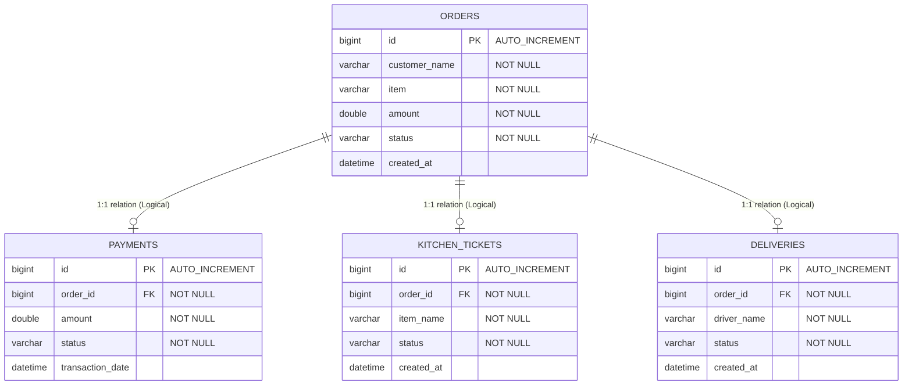

# Database Design - Online Food Order Processing System

This document outlines the MySQL database schema and table relationships for the Food Order Processing microservices.

---

## 1. Database Schema Overview

We use a single MySQL database instance named `food_order_db`. The tables are managed by the respective Spring Boot microservices.

---

## 2. Table Specifications

### A. Table: `orders` (Managed by `order-service`)
Stores primary customer orders.

| Column | Data Type | Key | Null | Default | Description |
|---|---|---|---|---|---|
| `id` | BIGINT | PK | NO | AUTO_INCREMENT | Unique order identifier |
| `customer_name` | VARCHAR(255) | | NO | | Name of the customer placing order |
| `item` | VARCHAR(255) | | NO | | Food item ordered |
| `amount` | DOUBLE | | NO | | Order charge total |
| `status` | VARCHAR(55) | | NO | | State: `PLACED`, `PAYMENT_PROCESSING`, `KITCHEN_PREP`, `OUT_FOR_DELIVERY`, `DELIVERED`, `CANCELLED` |
| `created_at` | DATETIME | | YES | CURRENT_TIMESTAMP | Order timestamp |

---

### B. Table: `payments` (Managed by `payment-service`)
Logs all transaction histories.

| Column | Data Type | Key | Null | Default | Description |
|---|---|---|---|---|---|
| `id` | BIGINT | PK | NO | AUTO_INCREMENT | Unique payment transaction ID |
| `order_id` | BIGINT | | NO | | Associated order ID (logical FK to `orders.id`) |
| `amount` | DOUBLE | | NO | | Amount charged |
| `status` | VARCHAR(55) | | NO | | Outcome: `SUCCESS`, `FAILED` |
| `transaction_date`| DATETIME | | YES | CURRENT_TIMESTAMP | Timestamp of transaction |

---

### C. Table: `kitchen_tickets` (Managed by `kitchen-service`)
Tracks items cooking in the kitchen.

| Column | Data Type | Key | Null | Default | Description |
|---|---|---|---|---|---|
| `id` | BIGINT | PK | NO | AUTO_INCREMENT | Unique kitchen ticket ID |
| `order_id` | BIGINT | | NO | | Associated order ID (logical FK to `orders.id`) |
| `item_name` | VARCHAR(255) | | NO | | Food item name |
| `status` | VARCHAR(55) | | NO | | State: `PREPARING`, `READY` |
| `created_at` | DATETIME | | YES | CURRENT_TIMESTAMP | Kitchen ticket initialization time |

---

### D. Table: `deliveries` (Managed by `delivery-service`)
Logs rider dispatch status.

| Column | Data Type | Key | Null | Default | Description |
|---|---|---|---|---|---|
| `id` | BIGINT | PK | NO | AUTO_INCREMENT | Unique delivery record ID |
| `order_id` | BIGINT | | NO | | Associated order ID (logical FK to `orders.id`) |
| `driver_name` | VARCHAR(255) | | NO | | Assigned driver name |
| `status` | VARCHAR(55) | | NO | | State: `ASSIGNED`, `DELIVERED` |
| `created_at` | DATETIME | | YES | CURRENT_TIMESTAMP | Delivery dispatch timestamp |
